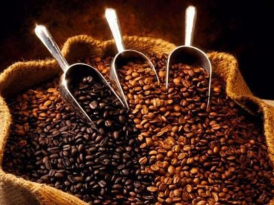
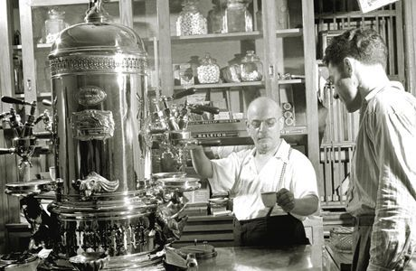

<!DOCTYPE html>
<html lang="uk","us">
<head>
<meta charset="UTF-8">
<title>Кяв'ярня- «Мілан»</title>

</head>
<body>
<header class="header">
<a class="logo">
LOGO
</a>
<nav class="nav">
<a href="#posts" class="nav-item">В чому унікальність нашої кав'ярні?</a>
<a href="#comments" class="nav-item">«Мілан»</a>
<a href="#posts" class="nav-item">Спілкування</a>
</nav>

</header>
<main class="main">

<h1>В чому унікальність нашої кав'ярні?</h1>

Кав'ярня «Мілан» спрямована на створення унікального та індивідуального простору саме для Вас! Наша неперевершеність в швидкості, якості та висококласному обслуговуванні. Справжня італійська атмосфера нашого закладу поєднана з відбірними кавовими та чайними напоями, зробить настрій на весь день. Відпочинок чи робочий день, починайте з нами не пожалієте!

  

Зв'язок з нами

  
Наша локація

«Мілан»

<h1>«Мілан»</h1>

Протягом останніх років кав'ярні стали звичайною частиною нашого з Вами життя. Наша кав'ярня «Мілан» створена з метою надати Вам унікальний кавовий та кулінарський досвід «Міланького стилю». Ми зосереджени на вишуканих смаках та затишній атмосфері, наша кав'ярня пропонує не лише напої високої якості, але й враження, які залишають невимовні спогади. Наша місія - перетворити кожну Вашу кавову зустріч у вишуканий ритуал та створювати для Вас неперевершені задоволення від вишуканого кавового досвіду.

  

<h1>Історія кави. Поява еспрессо, як кавового напою.</h1>

Фактично рецептура еспресо з’явилась із виникненням самих кавових машин, які готують порційні напої. Це відбулось на початку ХХ ст. в Мілані. Моделі кавових машин Беццара та Павоні мали один суттєвий недолік: прямий паровий тиск спалював кавові масла, що не найкраще впливало на смакові якості напою. Лише з появою технології подачі гарячої води під тиском в 1947 році з’явилась еспресо в її класичному вигляді.

<h1>Menue "Milan"</h1>

Menu of our cafe: Espresso, Ristretto, Doppio, Lungo, Americano, Latte, Cappuccino Macchiato, Flat white, Viennese coffee, Ruff coffee, Frappe, Glasse, Affogato, Irish or Irish coffee, Green, black and herbal tea, Carbonated and non-carbonated water, Signature drinks, Hot chocolate, Cocoa. And other delicacies.Цікавий факт, що приводом для його винаходу, стали співробітники його компанії, які витрачали занадто багато часу на приготування кави під час перерв. Потім в 1905 році, він продав патент на кавомашини Десідеріо Павоні. Сам Павоні придумав готувати еспресо з більш низькою температурою води, і при певному тиску, що дозволило зробити каву більш м'яким і насиченим. Він був першим, хто запустив масове виробництво кавоварок для кафе.

  

<h1 class="comment-title">Коментарі</h1>

Вам потрыбно змынити назву) Дякуэмо за гарний настрій, смачна кава та пртьмна атмосфера.

<h1 class="comment-title">Вибір кави для еспресо</h1>

Найпоширенішими є кавові зерна трьох сортів – це арабіка, робуста і ліберіка. Причому в упаковці може бути як кава виключно одного сорту, так і купажі, тобто суміші різних сортів в різних пропорціях. Найчастіше зернова кава еспресо це або чиста арабіка, або суміш арабіки та робусти. Ліберіка ж мало поширена і найчастіше зустрічається лише як один із компонентів купажу – її додають в невеликій кількості для посилення аромату кави.

<h1 class="comment-title"> «Мілан»</h1>

Кращий напій готується з зерен бразильської арабіки. Сучасним стандартом якості є використання свіжообсмаженої кави. Класичний рецепт не має на увазі додавання молока, проте існують інші різновиди цього напою кави з молоком. Що стосується цукру - то в "класиці" прийнято кидати в чашу 1 кубик цукру, не розмішуючи, даючи йому трохи розчинитися перед вживанням. Після того як чашка випита 1-2-3 ковтками, обсяг цукру стікає з дна чашки, даючи обволікаючу солодкість роті і губам, щоб смак напою залишився приємним, не гірким спогадом.Італійський інститут кави дає таке визначення еспресо: напій об'ємом приблизно 25 мілілітрів, що готується гарячою водою (до 96°) під тиском в 9 бар з 7-8 г кави найкращого помелу за 20-30 секунд.

</main>
theme: jekyll-theme-minimal
<footer class="footer"  id="footer">
</footer>
</body>
</html>
